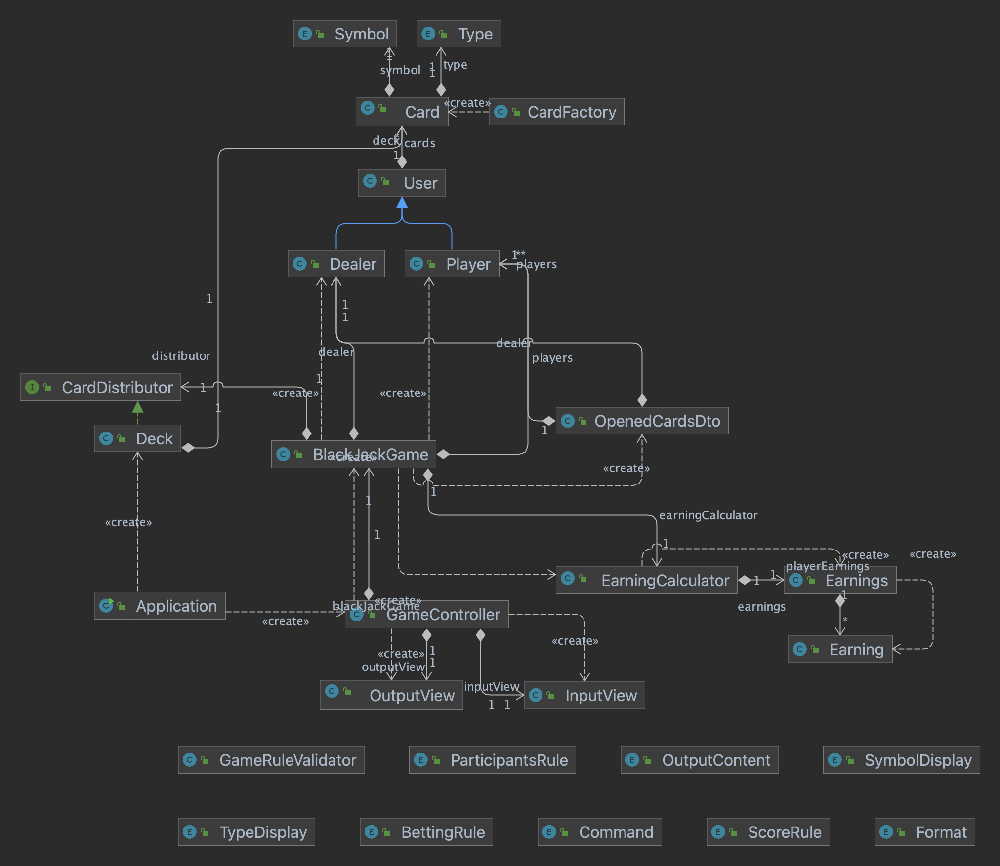

# [미션 - 블랙잭] 명세서

## 프로그램 구성 요소
1. 사용자
   1. 딜러 (컴퓨터)
      1. 가지고 있는 카드
   2. 플레이어 (1명 이상)
      1. 가지고 있는 카드
      2. 이름: 입력값
      3. 베팅 금액: 입력값
2. 카드 한 장
   1. 심볼 (ACE, TWO, THREE, ..., KING)
   2. 타입 (SPADE, DIAMOND, HEART, CLUB)
3. 게임 규칙 상수
   1. 블랙잭 : 21
   2. 딜러 제외 최소, 최대 인원 : 1 ~ 7 
   3. 최소, 최대 베팅 금액 : 5_000 ~ 10_000_000
4. 카드 덱
   1. 트럼프 카드 전체 (총 13*4 = 52장)
5. 수익 계산기

## 게임 진행 순서
1. 게임 시작, 딜
   1. 게임에 참여하는 플레이어 이름을 모두 입력받는다.
   2. 플레이어의 베팅 금액을 순서대로 입력받는다.
   3. 딜러와 플레이어에게 한 사람 당 2장의 카드를 지급한다. 
   4. 각 사용자가 받은 카드를 딜러, 등록한 플레이어 순서대로 카드를 오픈(출력)한다. 이 때 딜러의 카드는 한 장만 오픈한다.
   5. 딜러, 플레이어의 블랙잭 여부를 확인한다.
      1. 딜러가 블랙잭이면, 플레이는 진행하지 않는다.
         - 블랙잭이 아닌 모든 플레이어의 베팅 금액을 가져가고, 블랙잭인 플레이어는 베팅 금액을 돌려 받는다.
         - (딜러만 블랙잭인 경우는 요구사항에 명시 안되었으므로 일반 블랙잭 규칙을 적용함.)
      2. 딜러가 블랙잭이 아니고 플레이어가 블랙잭이면, 그 플레이어는 베팅 금액의 1.5배를 받고 플레이를 진행하지 않는다.
      
2. 플레이(히트/스테이)
   - 1~4번 까지의 과정을 모든 플레이어가 완료할 때까지 반복한다.
   1. 플레이어가 "n"(아니오)을 선택할 때까지 한 장의 카드를 더 받을지 물어본다.
   2. "y"(예)를 선택했을 경우 카드를 새로 추가하고, 사용자가 현재 가지고 있는 모든 카드를 출력한다.
   3. 처음부터 "n"(아니오)를 선택했을 경우, 사용자가 현재 가지고 있는 모든 카드를 출력한다.
   4. 딜러는 카드의 합을 계산하여 숫자가 이하인 경우에만 한 장의 카드를 추가한다. (17 이상이면 더 이상 추가하지 않는다.)

3. 결산
   1. 모든 사용자가 `히트/스테이`를 마치면 각 사용자의 카드 합을 계산해 결과를 오픈한다.
   2. 아래의 경우 중 해당되는 경우를 찾아 수익을 계산한다.
      - 딜러의 카드 합과 플레이어의 카드 합을 비교해, 21 또는 21에 더 가까운 숫자를 가진 플레이어는 승리한다.
      1. 딜러의 숫자가 21을 초과한 경우(버스트) 그 시점에 버스트되지 않은 플레이어는 가지고 있는 패와 상관 없이 모두 승리 처리한다.
         - 모든 플레이어 수익: 베팅 금액
         - 딜러 수익: (-베팅 금액)*(플레이어 수)
      2. 플레이어가 승리한 경우, 베팅 금액의 1배를 딜러에게 받는다.
         - 플레이어 수익: 베팅 금액
         - 딜러 수익: -베팅 금액
      3. 플레이어가 패배했거나 버스트인 경우 베팅 금액을 딜러가 가져간다.
         - 플레이어 수익: -베팅 금액
         - 딜러 수익: +베팅 금액
   3. 사용자 별 최종 수익을 출력한다.

## 기능 목록
### 도메인 로직
1. 
   - [x] 게임에 참여할 사용자를 모두 등록하는 기능
     - [x] 플레이어 객체를 새로 생성하여 이름, 베팅 금액을 저장한다.
     - [x] 정보를 저장한 플레이어 객체를 사용자 목록에 저장한다.
       - [x] `예외` 참여 인원이 유효하지 않을 경우 예외 발생
       - [x] `예외` 플레이어의 베팅 금액이 유효하지 않을 경우 예외 발생
       - [x] `예외` 이미 동일한 이름의 플레이어가 존재하는 경우 예외 발생
2. 
     - [x] 셔플된 트럼프 카드를 관리하는 덱(Deck)을 세팅하고 사용하는 기능
       - [x] 덱에서는 가장 위에 있는 카드 한 장을 꺼낼 수 있다.
           - [x] `예외` 트럼프 카드의 모든 카드를 소진했을 경우 예외 발생
3. 
    - [x] 사용자에게 카드를 지급하는 기능
      - [x] 전달받은 이름을 가진 사용자의 정보에 덱에서 꺼낸 카드를 저장한다.
        - [x] `예외` 전달받은 사용자 이름이 유효하지 않을 경우 예외 발생
        - [x] `예외` 이미 가지고 있는 카드와 동일한 카드를 받았을 경우 예외 발생
4. 
   - [x] 사용자가 현재 가지고 있는 카드의 합을 계산하는 기능
     - [x] Ace를 가지고 있는 경우, 21을 넘지 않거나 21에 더 가까운 합으로 숫자를 선택하여 계산한다.
5. 
   - [x] 사용자의 버스트 여부를 확인하는 기능
     - [x] 현재 가지고 있는 카드의 합이 21을 넘는지 확인한다.
6. 
   - [x] 플레이어의 카드 추가 여부에 따라 카드를 지급하거나 하지 않는 기능
7. 
   - [x] 딜러의 카드 추가 여부에 따라 카드를 지급하거나 하지 않는 기능
     - [x] 딜러가 가지고 있는 카드의 합이 16 이하이면 추가하도록 하고, 17 이상이면 추가하지 않도록 한다.
     - [x] 추가 여부가 거짓이 될 때까지 카드 추가를 반복한다.
8. 
   - [x] 딜러, 플레이어가 가지고 있는 카드를 오픈하는 기능 (출력을 위한 값 전달)
      - [x] 등록한 사용자 순서대로 정보를 제공한다.
      - [x] 게임 시작 시 오픈할 때에는, 딜러의 두 카드 중 한 카드의 정보만 제공한다.
9. 
   - [x] 수익 정보를 저장하고, 필요에 따라 딜러와 플레이어의 수익을 더하고 빼는 기능
     - [x] 사용자 이름 리스트를 전달받아 수익 정보를 저장하는 클래스 생성
       - [x] `예외` 전달받은 사용자 이름 리스트가 null 또는 비어있을 경우 예외 발생
     - [x] 특정 금액을 사용자 수익에는 더하고, 딜러 수익에는 빼도록 계산
       - [x] `예외` 존재하지 않는 이름의 사용자 수익을 업데이트하려고 할 경우 예외 발생
10.
    - [x] 카드 상태에 따라 수익을 계산하는 기능
      - [x] 오픈 후, 딜러와 플레이어의 블랙잭 여부에 따라 수익을 계산하는 기능
        - [x] 딜러가 블랙잭이면 계산 후 플레이를 진행하지 않도록 한다.
        - [x] 플레이어만 블랙잭이면 그 플레이어는 플레이에 참여하지 않도록 한다.
      - [x] 플레이 후, 한 플레이어와 그에 대한 딜러의 버스트 / 승리 여부에 따른 수익을 계산하는 기능
         - [x] 딜러와 플레이어의 카드 합을 비교한다.
         - [x] 비교한 결과에 따라 해당 플레이어의 수익, 딜러의 수익을 업데이트한다.

      
### UI 로직
(기능 테스트를 통해 입출력 확인할 것)
1.
    - [x] 게임에 참여할 모든 사용자의 이름을 입력받는 기능
      - [x] 정해진 구분자(`,`)를 기준으로 분리한다.
      - [x] 시작과 끝의 공백은 삭제해서 동일한 이름으로 취급한다. (`pobi`, ` pobi`)
      - [x] 정해진 구분자가 없는 입력값일 경우 한 명의 사용자의 이름으로 읽는다. (`hi!pobi`)
      - [x] `예외` 동일한 이름이 2명 이상 존재할 경우 예외 발생
      - [x] `예외` 범위 밖 인원 수일 경우 예외 발생
2.
    - [x] 플레이어의 베팅 금액을 입력받는 기능
      - [x] `예외` 숫자가 아닌 경우 예외 발생
      - [x] `예외` 범위 외 수일 경우 예외 발생
3.
    - [x] 형식에 맞춰 입력 요청 및 진행 안내 메시지를 출력하는 기능
      - [x] 게임에 참여할 사람의 이름을 입력 요청하는 메시지 출력
      - [x] 입력 요청: `(사용자명)의 베팅 금액은?`
      - [x] 진행 안내: `딜러와 (사용자명, 사용자명, 사용자명)에게 2장의 카드를 나누었습니다.`
      - [x] 입력 요청: `(사용자명)는(/은) 한장의 카드를 더 받겠습니까?(예는 y, 아니오는 n)`
      - [x] `예외` 출력할 값이 null이면 예외 발생
4.
    - [x] 형식에 맞춰 전달받은 정보를 출력하는 기능
      - [x] 정해진 형식에 맞춰 사용자 별 카드 오픈 정보를 출력한다.
      - [x] 정해진 형식에 맞춰 사용자 별 카드 오픈 정보와 합산 점수를 함께 출력한다.
      - [x] 정해진 형식에 맞춰 사용자 이름과 수익을 출력한다.
      - [x] `예외` 출력할 값이 null이면 예외 발생
5. 
   - [x] 히트/스탠드 여부를 입력받는 기능
     - [x] `예외` 정해진 키워드가 아닌 경우 예외 발생
6. 
   - [x] 기능 오류, 사용자 입력 오류에 대해 사용자에게 알리고 처리하는 기능
     - [x] 기능 오류이면 전달받은 에러 메시지를 정해진 형식으로 출력 후 프로그램을 종료한다.
     - [x] 사용자 입력 오류이면 전달받은 에러 메시지를 정해진 형식으로 출력 후 다시 입력받는다.

## 클래스 설계

## 단위 테스트 목록
- [x] Domain-1 : 게임 참가자 등록
  - [x] 참여 인원이 유효하지 않을 경우 예외 발생
  - [x] 플레이어의 베팅 금액이 유효하지 않을 경우 : UI에서 검증, 도메인에서는 Map으로 전달받아 중복 없으므로 테스트하지 않음.
  - [x] 이미 동일한 이름의 플레이어가 존재하는 경우 예외 발생
- [x] Domain-2 : 카드 덱 세팅 및 사용
  - [x] 카드 덱 세팅: 기본 트럼프 카드 세트로부터 한 장이라도 셔플되었는지 확인
  - [x] 카드 덱 사용: 카드를 꺼낼 때, 덱이 비었을 경우 예외 발생
- [x] Domain-3 : 사용자 카드 지급
  - [x] 전달받은 사용자 이름이 유효하지 않을 경우 예외 발생
  - [x] 이미 가지고 있는 카드와 동일한 카드를 받았을 경우 예외 발생
- [x] Domain-4 : 사용자 카드 합 계산
  - [x] Ace를 가지고 있는 경우, 21을 넘지 않거나 21에 더 가까운 합으로 계산
- [x] Domain-5 : 사용자 버스트 여부 확인
  - [x] 가지고 있는 카드의 합이 21을 넘으면 참을 반환
- [x] Domain-7 : 딜러 카드 추가
  - [x] 이미 가지고 있는 카드의 합이 16 이하이면 추가, 17 이상이면 추가하지 않음
- [x] Domain-8 : 카드 오픈
  - [x] 등록한 사용자 순서대로 정보를 제공
  - [x] 딜러 카드 전체공개 여부가 참이면 딜러의 카드를 모두 공개
  - [x] 딜러 카드 전체공개 여부가 거짓이면 딜러의 카드 중 첫번째 카드만 공개
- [x] Domain-9 : 수익 정보 클래스 생성, 업데이트
  - [x] 수익 클래스 생성 시, 전달받은 사용자 이름 리스트가 null 또는 비어있을 경우 예외 발생
  - [x] 존재하지 않는 이름의 사용자 수익 조회 시 예외 발생
  - [x] 특정 금액을 사용자 수익에는 더하고, 딜러 수익에는 빼도록 계산
- [x] Domain-10 : 수익 계산
  - [x] 블랙잭 여부에 따라 다르게 수익 계산
  - [x] 각 플레이어의 푸쉬(동점), 승리, 패배, 버스트에 따라 다르게 수익 계산
  - [x] 딜러가 버스트이면 버스트 제외한 플레이어 모두 베팅 금액만큼 수익 계산

## 리팩토링 목록
- [x] 클래스 분리
  - [x] InputView, OutputView 검증로직 메소드를 Validator 클래스로 분리
  - [x] OutputView의 카드 정보 변환 로직 메소드를 Converter 클래스로 분리
  - [x] BlackJackGame의 멤버 변수 players를 일급 콜렉션 클래스로 분리
- [x] 클래스 설계 검토
  - [x] 로직 수행 객체와 Dto 구분하기 (getter, setter 검토)
  - [X] GameController에서 모델 로직 수행할 필요 없게 만들기
- [x] 메소드 중복 최소화
  - [x] EarningCalculator의 계산 메소드 하나로 줄이기
